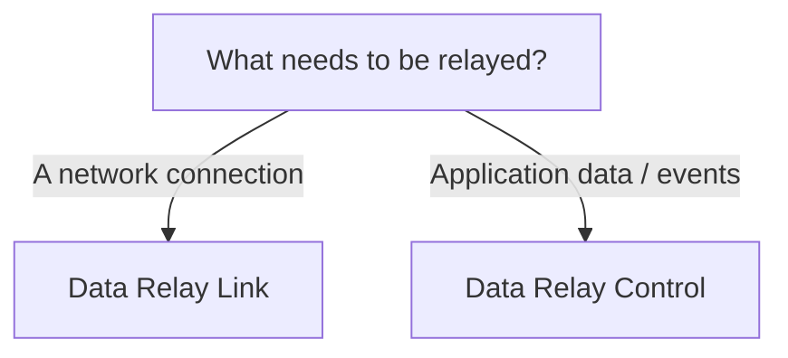

# Choose a Product

Start with one question: **what are you trying to relay?**

## Choose Data Relay Link for connectivity

Use **Data Relay Link** when you need controlled network reachability:

- external administrator/support access to selected internal SSH, web, RDP, API, or other required services;
- internal systems in a closed/restricted network reaching only approved external services;
- approved destinations such as update services, package repositories, license servers, or SaaS/API endpoints;
- simpler operations than maintaining separate VPN, NAT, firewall, proxy, or Squid changes for each requirement.

[Go to Data Relay Link documentation](https://link.datarelay.run)

## Choose Data Relay Control for data brokering

Use **Data Relay Control** when you need to collect and distribute enterprise application data or events:

- collect from SaaS, APIs, databases, files/logs, or devices/IoT;
- send one source to many destinations;
- filter/select records and fields;
- transform data before delivery;
- mask/remove sensitive or unnecessary data;
- deliver destination-specific data to SIEM, XDR, Data Lake, SOAR, Analytics, or custom applications;
- centralize data-delivery visibility and management.

[Go to Data Relay Control documentation](https://control.datarelay.run)

## If your environment needs both

You can use both products independently when you have both connectivity and data-integration requirements. They remain separate products with separate purposes and documentation.
