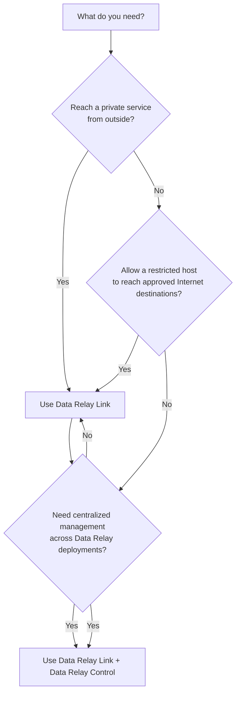

# Choose a Product

Start with the connectivity problem you are trying to solve.

## Data Relay Link

Choose **Data Relay Link** when the immediate requirement is connectivity:

- publish SSH, HTTP/HTTPS, or another selected TCP service from a private network;
- avoid inbound NAT configuration on each remote client;
- provide controlled HTTP/HTTPS egress from a restricted host;
- manage a small deployment directly.

[Go to Data Relay Link documentation](https://link.datarelay.run)

## Data Relay Control

Add **Data Relay Control** when the environment needs a centralized management and policy layer on top of Data Relay deployments.

Use the dedicated Control documentation to confirm the current implemented capabilities before designing a deployment around them.

[Go to Data Relay Control documentation](https://control.datarelay.run)

## Typical starting point

For most small environments, start with **Data Relay Link**. Introduce **Data Relay Control** when central visibility, shared policy, or coordinated administration becomes a real operational requirement.
