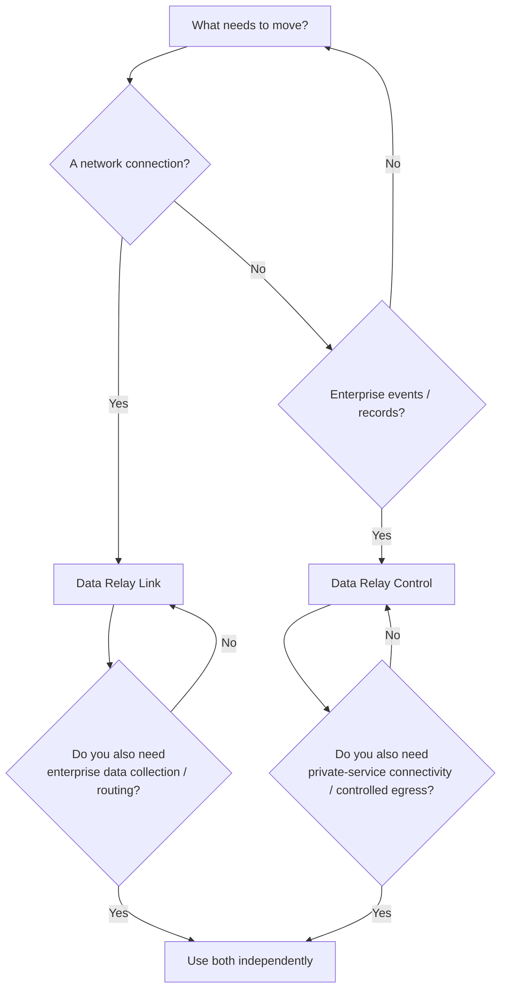

# Choose a Product

Start with the type of movement you need to control.

## Data Relay Link — choose it for connectivity

Use **Data Relay Link** when the requirement is to create a narrowly scoped connection:

- reach SSH, HTTP/HTTPS, or another selected TCP service behind NAT/firewalls;
- avoid configuring inbound NAT on every remote client;
- give a restricted host access only to approved HTTP/HTTPS destinations;
- keep connectivity explicit and locally enforced.

[Go to Data Relay Link documentation](https://link.datarelay.run)

## Data Relay Control — choose it for enterprise data flow

Use **Data Relay Control** when the requirement is to collect, process, govern, and deliver enterprise data:

- configure Connectors, Credentials, Sources, Streams, Routes, and Destinations;
- collect or receive source events;
- route one Stream to multiple destinations;
- apply destination-specific Transform, Protection, Classification, or Policy;
- monitor runtime evidence, delivery outcomes, health, and audit;
- operate backup/restore and other lifecycle functions.

[Go to Data Relay Control documentation](https://control.datarelay.run)

## When you need both

You can deploy both products when your environment has both connectivity and enterprise data-flow requirements.

However, treat them as **independent products today**. Data Relay Control does not currently register, monitor, configure, or synchronize Data Relay Link instances through a product-to-product management protocol.

<Note>
  The dedicated Link and Control sites are authoritative for installation steps, stable/development release status, security boundaries, and current implementation details.
</Note>
