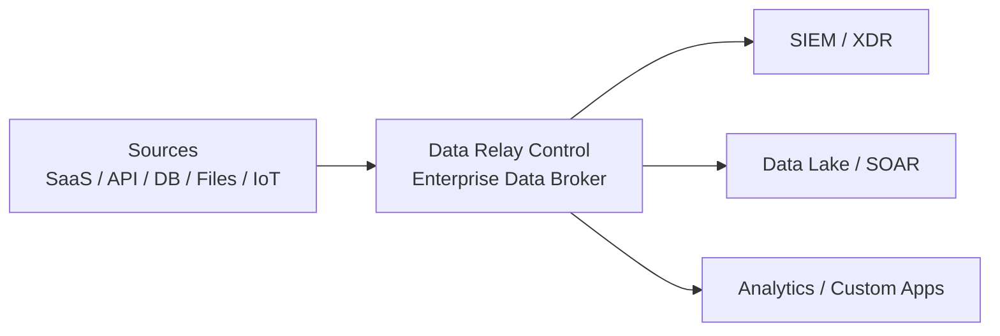

# Data Relay

**Two different products. One shared idea: relay only what is needed, safely and simply.**

Data Relay is the common home for **two independent products**. They are not two components of one runtime and neither product depends on the other.

<CardGroup cols={2}>
  <Card title="Data Relay Link" icon="link" href="https://link.datarelay.run">
    **Secure bidirectional connectivity for private, isolated, and restricted networks.**

    Safely connect an external administrator to selected internal services, or let an internal system reach only approved external services.
  </Card>

  <Card title="Data Relay Control" icon="sliders" href="https://control.datarelay.run">
    **An Enterprise Data Broker for application data and events.**

    Collect data once, process and protect it, then distribute the right data to the right destinations.
  </Card>
</CardGroup>

<Note>
  The similarity is the relay concept, not the data path. **Link relays network connections. Control brokers application-layer data and events.** This site is a product directory and comparison point, not a description of one integrated platform.
</Note>

## Data Relay Link — connect what must be reachable

Data Relay Link solves **connectivity problems** in environments where ordinary inbound and outbound access is difficult to operate securely.

### Outside → inside: secure remote access

An administrator or support engineer on the Internet can reach only the internal services that have been explicitly exposed through Data Relay Link, such as SSH, web, RDP, or API services.

This reduces the operational burden of repeatedly changing VPN, NAT, and firewall settings just to reach a private system.

### Inside → outside: restricted Internet access

A server in a closed or restricted network can be allowed to connect only to approved external destinations, for example:

- security update services;
- package repositories such as apt, yum, or npm;
- license servers;
- approved SaaS or API endpoints.

Unapproved sites, personal services, messaging/SNS, and other external destinations remain blocked by policy. The concept is **not to open the Internet**, but to allow only the connections the workload actually needs.

### What Link is designed to provide

<CardGroup cols={2}>
  <Card title="Bidirectional connectivity" icon="arrows-left-right">
    Handle external-to-internal remote access and internal-to-external restricted connectivity with one relay approach.
  </Card>
  <Card title="Allow only what is needed" icon="shield-halved">
    Expose selected internal services and permit only approved external hosts/services instead of broad network access.
  </Card>
  <Card title="Simpler restricted-network operations" icon="wrench">
    Reduce recurring VPN, NAT, firewall, proxy, and Squid configuration work in segmented or air-gapped environments.
  </Card>
  <Card title="Access control and audit" icon="clipboard-list">
    Centralize connection control and connection records for easier administration and support.
  </Card>
</CardGroup>

The Link concept is especially suited to government/finance, manufacturing and OT, security appliances, customer isolated networks, and other environments where connectivity must stay narrow and controlled.

[Explore Data Relay Link](https://link.datarelay.run)

## Data Relay Control — broker the data itself

Data Relay Control solves a **data integration and delivery problem**, not a remote-access problem.

It is an **Enterprise Data Broker** for structured and unstructured application data and events. The product collects from sources such as SaaS applications, APIs, databases, files/logs, and devices/IoT, then sends data to destinations such as SIEM, XDR, Data Lake, SOAR, analytics systems, and custom applications.

### Collect once, send where needed

One source can feed many destinations without every destination pulling directly from the source. This reduces duplicate integration work, source-system load, and unnecessary network traffic.

### Process data before delivery

Data Relay Control can select and process data for each destination, including the concepts shown in the product material:

- filtering and record selection;
- transformation;
- masking or removal of sensitive/unnecessary data;
- protection and policy application;
- destination-specific delivery.

Different routes can therefore send different versions of the same source data according to each destination's security, analysis, or usage requirements.

### Operate data delivery centrally

The Control product emphasizes unified data visibility and management, delivery monitoring, governance/compliance, reliability, and reduced integration cost and complexity. Its Stream onboarding flow is built around **Connect → Sample & Record Selection → Destinations → Route Processing → Deploy**.

[Explore Data Relay Control](https://control.datarelay.run)

## The difference in one table

| | Data Relay Link | Data Relay Control |
| --- | --- | --- |
| Primary problem | Network connectivity | Enterprise data integration and delivery |
| What it relays | **Connections** | **Application data / events** |
| Typical direction | Outside → inside and inside → approved outside | Sources → one or many destinations |
| Typical inputs | Remote users, private/restricted hosts | SaaS, API, database, files/logs, devices/IoT |
| Typical outputs | Selected private services or approved Internet services | SIEM, XDR, Data Lake, SOAR, Analytics, Custom Apps |
| Key control | Which host/service may connect | Which records/fields go where and how they are transformed/protected |
| Main operational goal | Safer, simpler restricted-network connectivity | Collect once, process centrally, deliver appropriately |
| Product dependency | None | None |

## Shared philosophy, separate products

Both products start from the same practical idea: **do not broadly open or duplicate what can be relayed selectively**.

Data Relay Link applies that idea to **network reachability**. Data Relay Control applies it to **enterprise data movement**. Their architectures, runtimes, use cases, and product documentation are separate.

<CardGroup cols={2}>
  <Card title="Open Link Documentation" icon="link" href="https://link.datarelay.run">
    Installation, connectivity use cases, deployment, operation, and security boundaries for Data Relay Link.
  </Card>
  <Card title="Open Control Documentation" icon="sliders" href="https://control.datarelay.run">
    Connectors, Streams, Routes, Destinations, processing, governance, and operations for Data Relay Control.
  </Card>
</CardGroup>
