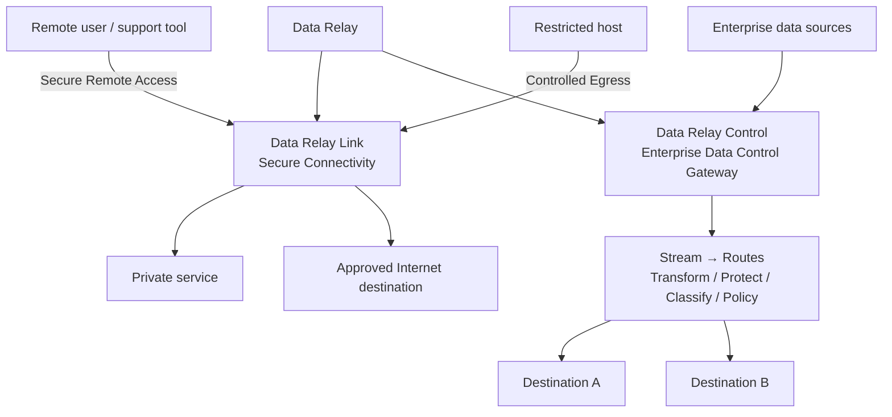
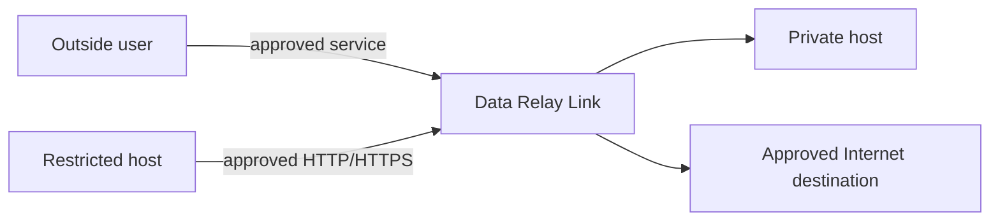
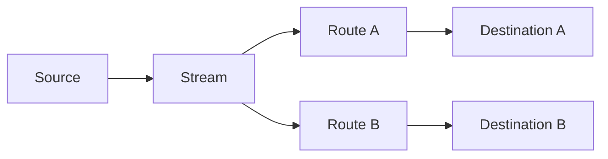

# Data Relay

**Relay only what matters — a connection when a system needs access, or data when an enterprise workflow needs delivery.**

Data Relay is a product family with two distinct products:

- **Data Relay Link** — secure connectivity for private, NATed, firewalled, and restricted environments.
- **Data Relay Control** — an Enterprise Data Control Gateway that collects, processes, protects, and delivers data to one or more destinations.

<Note>
  Link and Control share the Data Relay product family, but they currently solve different problems and run different data paths. Data Relay Control is **not currently a centralized manager for Data Relay Link**; the current Control implementation has no Link registration, heartbeat, policy-delivery, or state-synchronization protocol.
</Note>

## Understand the platform in 30 seconds



## Choose the product for the job

<CardGroup cols={2}>
  <Card title="Data Relay Link" icon="link" href="https://link.datarelay.run">
    Connect selected private services to authorized remote users, or give restricted hosts narrowly controlled HTTP/HTTPS egress.
  </Card>

  <Card title="Data Relay Control" icon="sliders" href="https://control.datarelay.run">
    Collect enterprise data, process it per route, apply optional protection and policy, and deliver it to one or many destinations.
  </Card>
</CardGroup>

## Data Relay Link

**Connection relay for restricted networks**

Data Relay Link focuses on making a specific connection possible without broadly connecting entire networks.

- **Secure Remote Access** — publish selected SSH, HTTP/HTTPS, or other TCP services from systems behind NAT or firewalls.
- **Controlled Egress** — allow restricted hosts to reach approved FQDN/port combinations through an HTTP/HTTPS proxy with default-deny behavior.
- **Small standalone operation** — designed for focused deployments that can be managed directly without a separate central controller.



[Explore Data Relay Link](https://link.datarelay.run)

## Data Relay Control

**Enterprise data collection, processing, governance, and delivery**

Data Relay Control sits directly in the enterprise data path. It is not only a configuration plane: the runtime fetches or receives events, processes them, delivers them, and advances source checkpoints according to delivery outcomes.

Its core model is:

```text
One Stream → Many Routes → Many Destinations
```

Each Route can apply destination-specific processing such as:

```text
Transform → Protection → Classification → Policy → Delivery
```

The current product also includes local users/RBAC, connectors and credentials, source/stream/route/destination management, runtime evidence, audit, backup/restore, and newer Marketplace and safe-change capabilities on the audited development branch.



[Explore Data Relay Control](https://control.datarelay.run)

## Product responsibilities

| Area | Data Relay Link | Data Relay Control |
| --- | --- | --- |
| Primary purpose | Secure connectivity | Enterprise data-flow control and delivery |
| Main data path | Connections | Events / records |
| Remote access to private services | **Yes** | No |
| Controlled outbound web access | **Yes** | No |
| Collect enterprise source data | No | **Yes** |
| Transform / protect / classify / policy-process data | No | **Yes** |
| Multi-destination delivery | No | **Yes** |
| Carries data in its own runtime | Connection relay | **Yes — active processing and delivery runtime** |
| Standalone use | **Yes** | **Yes** |
| Current Link↔Control management integration | Not required | **Not implemented** |

## How the products relate today

The products belong to the same Data Relay family, but the current implementations should be deployed and evaluated independently.

- Use **Link** for connectivity problems.
- Use **Control** for enterprise data collection, processing, governance, and delivery problems.
- Do **not** assume that deploying Control automatically centralizes Link administration today.

Future integration may be added only when it exists in the implementation and is documented by both products.

## Start here

<CardGroup cols={2}>
  <Card title="Choose a Product" icon="route" href="/getting-started/choose-a-product">
    Start from the problem you need to solve: connectivity or enterprise data flow.
  </Card>

  <Card title="Platform Architecture" icon="sitemap" href="/platform/architecture">
    See the two independent data paths and where each product sits.
  </Card>

  <Card title="Link vs Control" icon="scale-balanced" href="/platform/link-vs-control">
    Compare responsibilities, runtime behavior, and deployment fit side by side.
  </Card>

  <Card title="Product Status" icon="circle-info" href="/reference/product-status">
    Check release boundaries and the authoritative product-specific documentation.
  </Card>
</CardGroup>
