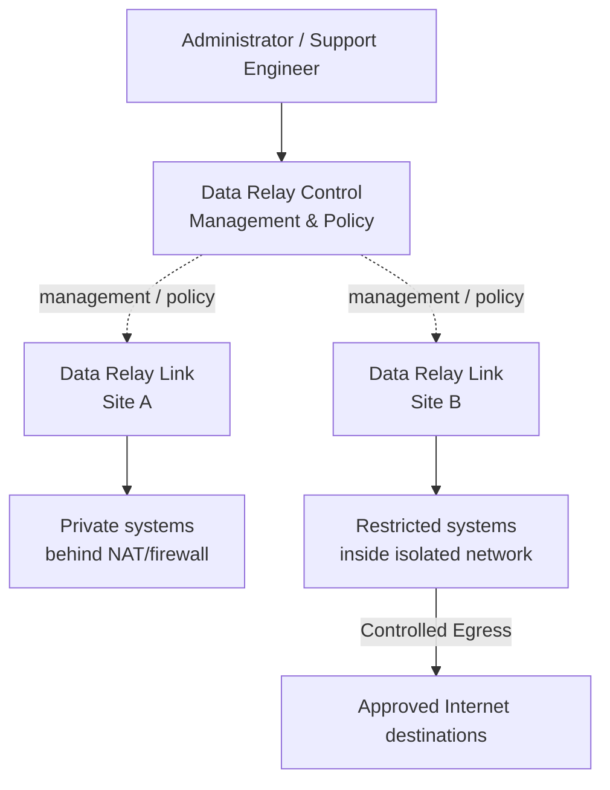
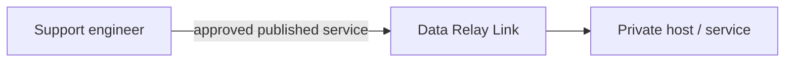
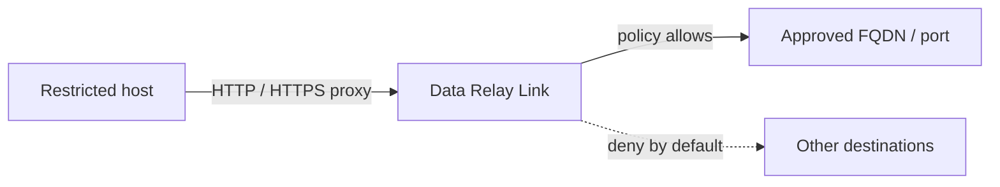

# Data Relay

**Connect only what is needed — without turning an isolated environment into a fully connected network.**

Data Relay is a lightweight connectivity platform for restricted, private, and isolated environments. It is organized around two products with clearly separated roles:

- **Data Relay Link** — connectivity for Secure Remote Access and Controlled Egress.
- **Data Relay Control** — centralized management and policy for Data Relay environments.

<Note>
  Data Relay is designed to keep connectivity narrow and explicit. It is not intended to become a general-purpose VPN, full RMM platform, or large SASE stack.
</Note>

## Understand the platform in 30 seconds

## Choose the product you need

<CardGroup cols={2}>
  <Card title="Data Relay Link" icon="link" href="https://link.datarelay.run">
    Secure Remote Access and Controlled Egress for systems behind NAT, firewalls, or restricted outbound policies.
  </Card>

  <Card title="Data Relay Control" icon="sliders" href="https://control.datarelay.run">
    Centralized management, policy, visibility, and operations for Data Relay environments.
  </Card>
</CardGroup>

## Two connectivity directions

### Secure Remote Access

Outside → inside

Use this when a remote system is behind NAT or a firewall and support staff need controlled access to SSH, HTTP/HTTPS, or another published TCP service without first building a VPN path.

### Controlled Egress

Inside → approved Internet destinations

Use this when a restricted host needs narrowly controlled outbound Internet access without opening broad network connectivity.

## Product responsibilities

| Area | Data Relay Link | Data Relay Control |
| --- | --- | --- |
| Secure Remote Access | **Yes** | Central management / policy role |
| Controlled Egress | **Yes** | Central management / policy role |
| Local connectivity enforcement | **Yes** | No direct data-path role implied |
| Centralized visibility | Local scope | **Primary role** |
| Central policy management | Local policy support | **Primary role** |
| Small standalone deployment | **Yes** | Optional |

<Warning>
  Data Relay Control capabilities are documented separately and may evolve independently from Data Relay Link. Refer to the Control documentation for the current implemented feature set and release status.
</Warning>

## Start here

<CardGroup cols={2}>
  <Card title="Choose a Product" icon="route" href="/getting-started/choose-a-product">
    Decide whether you need Link only or centralized Control.
  </Card>

  <Card title="Platform Architecture" icon="sitemap" href="/platform/architecture">
    Understand the separation between connectivity, management, policy, and data paths.
  </Card>

  <Card title="Link vs Control" icon="scale-balanced" href="/platform/link-vs-control">
    Compare the two products by responsibility and deployment model.
  </Card>

  <Card title="Product Status" icon="circle-info" href="/reference/product-status">
    See what is stable, under qualification, or documented elsewhere.
  </Card>
</CardGroup>
