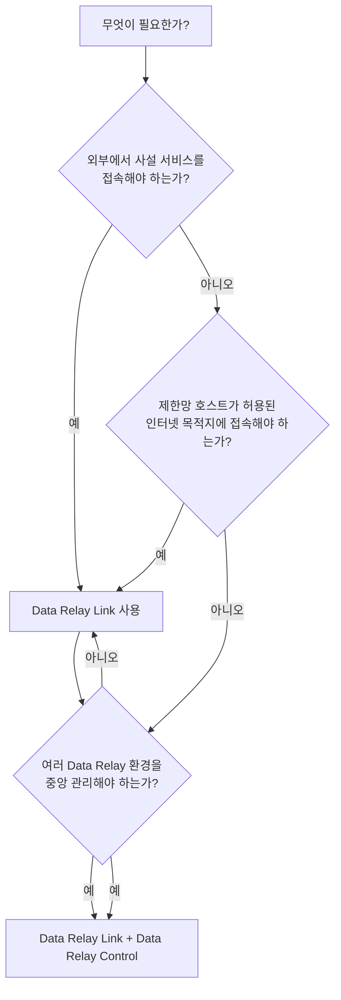

# 제품 선택

먼저 해결하려는 연결 문제부터 판단하면 됩니다.

## Data Relay Link

즉시 필요한 것이 **연결**이라면 Data Relay Link부터 사용합니다.

- 사설망의 SSH, HTTP/HTTPS 또는 선택된 TCP 서비스를 공개해야 한다.
- 각 원격 클라이언트에 inbound NAT를 설정하고 싶지 않다.
- 제한망 호스트에 허용된 HTTP/HTTPS egress만 제공하고 싶다.
- 소규모 환경을 직접 관리하면 충분하다.

[Data Relay Link 문서로 이동](https://link.datarelay.run)

## Data Relay Control

여러 Data Relay 배포를 하나의 관리/정책 계층에서 운영해야 한다면 **Data Relay Control**을 추가합니다.

실제 설계 전에 Control 전용 문서에서 현재 구현된 기능을 확인하세요.

[Data Relay Control 문서로 이동](https://control.datarelay.run)

## 일반적인 시작 방법

대부분의 소규모 환경은 **Data Relay Link부터 시작**하는 것이 좋습니다. 중앙 가시성, 공통 정책, 통합 관리가 실제 운영 요구사항이 되었을 때 **Data Relay Control**을 추가합니다.
