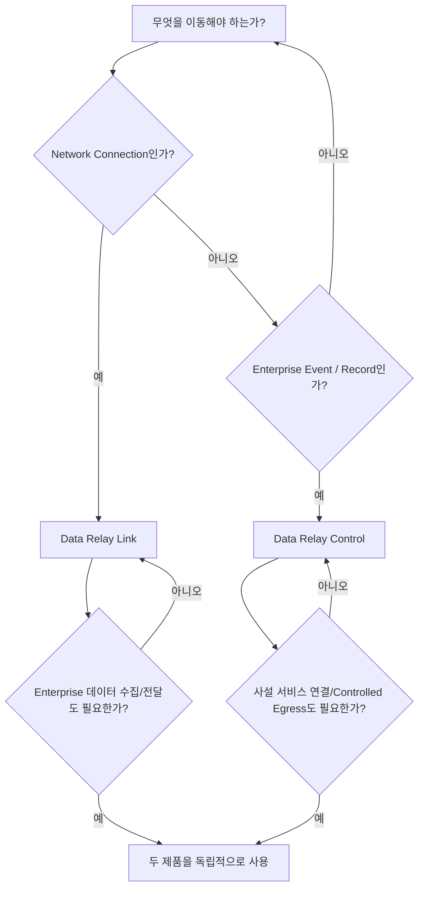

# 제품 선택

먼저 **무엇을 전달하고 제어해야 하는지**부터 판단하면 됩니다.

## Data Relay Link — 연결 문제가 중심일 때

**Data Relay Link**는 좁고 명시적인 Connection을 만들어야 할 때 사용합니다.

- NAT/방화벽 뒤의 SSH, HTTP/HTTPS 또는 선택된 TCP 서비스에 접근
- 각 원격 클라이언트마다 inbound NAT를 구성하지 않고 원격 접속
- 제한망 호스트가 허용된 HTTP/HTTPS 목적지에만 접근
- 연결 범위를 명시적으로 제한하고 로컬에서 enforcement

[Data Relay Link 문서로 이동](https://link.datarelay.run)

## Data Relay Control — 엔터프라이즈 데이터 흐름이 중심일 때

**Data Relay Control**은 엔터프라이즈 데이터를 수집하고 처리·거버넌스·전달해야 할 때 사용합니다.

- Connector, Credential, Source, Stream, Route, Destination 구성
- Source event를 fetch하거나 webhook 등으로 수신
- 하나의 Stream을 여러 Destination으로 Route
- 목적지별 Transform, Protection, Classification, Policy 적용
- runtime evidence, delivery outcome, health, audit 모니터링
- backup/restore 등 lifecycle 운영

[Data Relay Control 문서로 이동](https://control.datarelay.run)

## 두 제품이 모두 필요한 경우

연결 문제와 엔터프라이즈 데이터 흐름 문제가 동시에 있다면 두 제품을 함께 배포할 수 있습니다.

다만 현재는 **서로 독립적인 제품**으로 봐야 합니다. Data Relay Control은 현재 제품 간 관리 프로토콜을 통해 Data Relay Link를 등록·모니터링·설정·동기화하지 않습니다.

<Note>
  설치 방법, stable/development 릴리스 상태, 보안 경계, 정확한 구현 범위는 Link와 Control 각 전용 문서가 기준입니다.
</Note>
