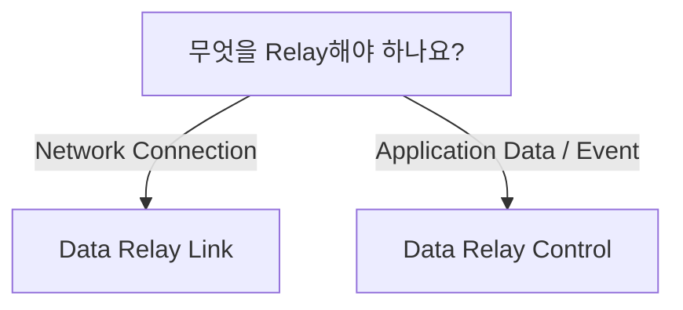

# 제품 선택

먼저 한 가지를 확인합니다. **무엇을 Relay하려고 합니까?**

## Connectivity가 필요하면 Data Relay Link

다음과 같은 요구사항이면 **Data Relay Link**가 맞습니다.

- 외부 관리자/지원 엔지니어가 내부의 선택된 SSH, Web, RDP, API 등의 서비스에 접속해야 함
- 폐쇄망/제한망 내부 시스템이 허용된 외부 서비스에만 접속해야 함
- 보안 업데이트, 패키지 저장소, 라이선스 서버, 승인된 SaaS/API 등의 목적지만 허용해야 함
- VPN, NAT, 방화벽, Proxy, Squid 설정을 요구사항마다 반복해서 관리하는 부담을 줄이고 싶음

[Data Relay Link 문서로 이동](https://link.datarelay.run)

## Data Brokering이 필요하면 Data Relay Control

다음과 같은 요구사항이면 **Data Relay Control**이 맞습니다.

- SaaS, API, Database, File/Log, Device/IoT 등에서 Application Data/Event를 수집해야 함
- 하나의 Source를 여러 Destination으로 전달해야 함
- 필요한 Record/Field만 선택해야 함
- 전달 전에 Transformation이 필요함
- 민감하거나 불필요한 데이터를 Masking/Removal해야 함
- SIEM, XDR, Data Lake, SOAR, Analytics, Custom App 등 목적지별로 다른 형태의 데이터가 필요함
- Data Delivery 상태를 중앙에서 가시화하고 관리하고 싶음

[Data Relay Control 문서로 이동](https://control.datarelay.run)

## 두 요구사항이 모두 있는 경우

두 제품을 각각 독립적으로 사용할 수 있습니다. Link는 Connectivity를, Control은 Data Integration/Delivery를 해결하며 서로 다른 목적과 문서를 갖습니다.
