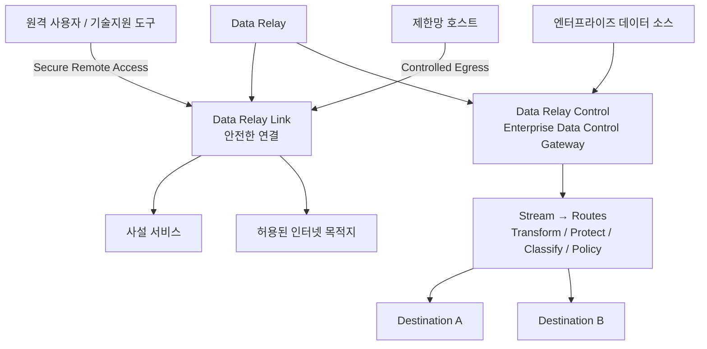
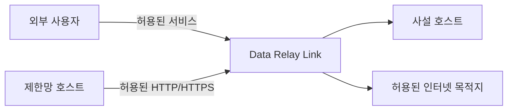
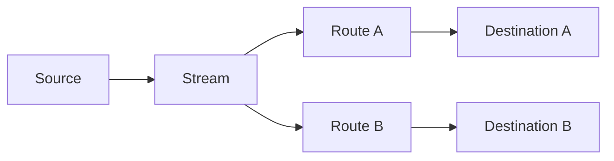

# Data Relay

**필요한 연결만 전달하고, 필요한 데이터만 목적지까지 제어해서 전달합니다.**

Data Relay는 역할이 다른 두 제품으로 구성된 제품군입니다.

- **Data Relay Link** — 사설망, NAT/방화벽 뒤 시스템, 제한망을 위한 안전한 연결 제품
- **Data Relay Control** — 엔터프라이즈 데이터를 수집·처리·보호·정책 적용·전달하는 Enterprise Data Control Gateway

<Note>
  Link와 Control은 같은 Data Relay 제품군에 속하지만 현재는 서로 다른 문제와 데이터 경로를 담당합니다. **Data Relay Control은 현재 Data Relay Link의 중앙관리 서버가 아닙니다.** 현재 Control 구현에는 Link 등록, heartbeat, 정책 배포, 상태 동기화 프로토콜이 없습니다.
</Note>

## 30초 안에 이해하기



## 어떤 제품이 필요한가요?

<CardGroup cols={2}>
  <Card title="Data Relay Link" icon="link" href="https://link.datarelay.run">
    선택된 사설 서비스를 외부에서 안전하게 접속하거나, 제한망 호스트에 허용된 HTTP/HTTPS egress만 제공할 때 사용합니다.
  </Card>

  <Card title="Data Relay Control" icon="sliders" href="https://control.datarelay.run">
    엔터프라이즈 데이터를 수집하고 Route별로 처리·보호·정책 적용한 뒤 하나 이상의 목적지로 전달할 때 사용합니다.
  </Card>
</CardGroup>

## Data Relay Link

**제한된 네트워크를 위한 Connection Relay**

Data Relay Link는 네트워크 전체를 연결하는 대신, 실제로 필요한 연결만 명시적으로 허용하고 전달하는 데 초점을 둡니다.

- **Secure Remote Access** — NAT/방화벽 뒤의 SSH, HTTP/HTTPS 또는 선택된 TCP 서비스를 외부에서 접속
- **Controlled Egress** — 제한망 호스트가 허용된 FQDN/포트에만 HTTP/HTTPS로 접근하도록 기본 거부 방식으로 제어
- **소규모 독립 운영** — 별도 중앙관리 서버 없이도 직접 운영할 수 있는 경량 배포 모델



[Data Relay Link 자세히 보기](https://link.datarelay.run)

## Data Relay Control

**엔터프라이즈 데이터 수집·처리·거버넌스·전달 Gateway**

Data Relay Control은 단순 설정 서버가 아니라 실제 데이터 경로에 위치합니다. 현재 runtime은 데이터를 fetch하거나 수신하고, 필요한 처리를 적용한 뒤 목적지로 전달하며, 전달 결과에 따라 source checkpoint를 진행합니다.

핵심 모델은 다음과 같습니다.

```text
One Stream → Many Routes → Many Destinations
```

각 Route에서는 목적지별로 다음과 같은 처리를 적용할 수 있습니다.

```text
Transform → Protection → Classification → Policy → Delivery
```

현재 제품에는 사용자/RBAC, Connector·Credential·Source·Stream·Route·Destination 관리, runtime evidence, audit, backup/restore가 포함되며, 감사된 개발 브랜치에는 Marketplace와 Safe Change 계열 기능도 구현되어 있습니다.



[Data Relay Control 자세히 보기](https://control.datarelay.run)

## 제품 역할 비교

| 영역 | Data Relay Link | Data Relay Control |
| --- | --- | --- |
| 핵심 목적 | 안전한 연결 | 엔터프라이즈 데이터 흐름 제어 및 전달 |
| 주요 처리 단위 | Connection | Event / Record |
| 사설 서비스 Remote Access | **예** | 아니오 |
| 제한된 outbound web access | **예** | 아니오 |
| 엔터프라이즈 Source 데이터 수집 | 아니오 | **예** |
| Transform / Protection / Classification / Policy | 아니오 | **예** |
| 여러 Destination으로 전달 | 아니오 | **예** |
| 자체 runtime에서 데이터 처리 | 연결 relay | **예 — 실제 데이터 처리 및 전달** |
| 독립 배포 | **예** | **예** |
| 현재 Link↔Control 중앙관리 연동 | 필요 없음 | **미구현** |

## 현재 두 제품의 관계

두 제품은 같은 Data Relay 제품군에 속하지만 현재 구현 기준으로는 독립적으로 설계하고 운영해야 합니다.

- **Link**는 연결 문제를 해결합니다.
- **Control**은 엔터프라이즈 데이터 수집·처리·거버넌스·전달 문제를 해결합니다.
- 현재 **Control을 설치한다고 Link가 중앙관리되는 것은 아닙니다.**

향후 실제 제품 간 연동이 구현되고 양쪽 문서에서 확인될 때만 통합 관리 구조로 설명합니다.

## 시작하기

<CardGroup cols={2}>
  <Card title="제품 선택" icon="route" href="/ko/getting-started/choose-a-product">
    필요한 것이 안전한 연결인지, 엔터프라이즈 데이터 흐름 제어인지부터 판단합니다.
  </Card>

  <Card title="플랫폼 아키텍처" icon="sitemap" href="/ko/platform/architecture">
    Link와 Control이 각각 어떤 데이터 경로에 위치하는지 확인합니다.
  </Card>

  <Card title="Link vs Control" icon="scale-balanced" href="/ko/platform/link-vs-control">
    두 제품의 역할, runtime 동작, 적합한 사용 사례를 비교합니다.
  </Card>

  <Card title="제품 상태" icon="circle-info" href="/ko/reference/product-status">
    각 제품의 릴리스 범위와 전용 문서를 확인합니다.
  </Card>
</CardGroup>
