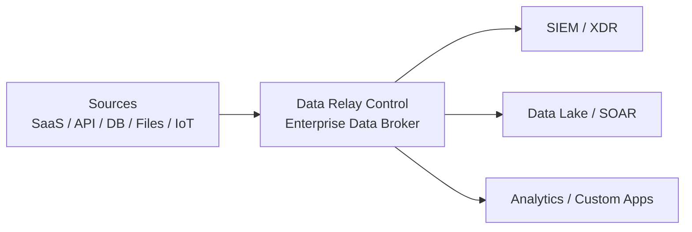

# Data Relay

**서로 다른 두 제품. 공통점은 하나입니다: 필요한 것만 더 안전하고 더 단순하게 Relay합니다.**

Data Relay는 **서로 독립적인 두 제품**을 소개하는 공통 진입점입니다. Link와 Control은 하나의 runtime을 나눈 구성요소가 아니며, 어느 한 제품을 사용하기 위해 다른 제품이 필요하지 않습니다.

<CardGroup cols={2}>
  <Card title="Data Relay Link" icon="link" href="https://link.datarelay.run">
    **사설망·폐쇄망·제한망을 위한 안전한 양방향 연결 제품**

    외부 관리자가 필요한 내부 서비스에 안전하게 접속하거나, 내부 시스템이 허용된 외부 서비스에만 접속하도록 연결을 Relay합니다.
  </Card>

  <Card title="Data Relay Control" icon="sliders" href="https://control.datarelay.run">
    **Application Data/Event를 위한 Enterprise Data Broker**

    데이터를 한 번 수집하고 필요한 처리와 보호를 적용한 뒤, 목적지별로 필요한 데이터를 전달합니다.
  </Card>
</CardGroup>

<Note>
  두 제품의 공통점은 Relay라는 개념이지 같은 데이터 경로를 쓴다는 뜻이 아닙니다. **Link는 Network Connection을 Relay하고, Control은 Application Layer의 Data/Event를 Broker합니다.** 이 사이트는 두 독립 제품을 소개하고 비교하는 포털입니다.
</Note>

## Data Relay Link — 필요한 연결만 안전하게

Data Relay Link는 일반적인 inbound/outbound 연결을 안전하게 운영하기 어려운 환경의 **연결 문제**를 해결합니다.

### 외부 → 내부: 안전한 원격 접속

인터넷의 관리자나 지원 엔지니어가 폐쇄망 또는 사설망 내부에 명시적으로 공개된 서비스에만 접속하도록 합니다. 예를 들어 SSH, Web, RDP, API와 같은 내부 서비스를 필요한 범위에서만 연결할 수 있습니다.

VPN, NAT, 방화벽 설정을 원격 접속이 필요할 때마다 반복해서 변경하는 부담을 줄이는 것이 핵심입니다.

### 내부 → 외부: 제한적 인터넷 연결

폐쇄망/제한망의 서버는 업무에 필요한 외부 목적지에만 접속하도록 허용할 수 있습니다. 대표적인 예는 다음과 같습니다.

- 보안 업데이트 서비스
- apt, yum, npm 등의 패키지 저장소
- 라이선스 서버
- 허용된 SaaS 또는 API 서비스

허용되지 않은 사이트, 개인용 서비스, SNS/메신저, 기타 외부 사이트는 정책에 따라 차단합니다. 핵심은 **인터넷 전체를 여는 것이 아니라 필요한 연결만 허용하는 것**입니다.

### Link가 제공하려는 핵심 가치

<CardGroup cols={2}>
  <Card title="양방향 연결" icon="arrows-left-right">
    외부→내부 원격 접속과 내부→외부 제한 연결을 하나의 Relay 방식으로 다룹니다.
  </Card>
  <Card title="필요한 대상만 허용" icon="shield-halved">
    전체 네트워크를 여는 대신 필요한 내부 서비스와 허용된 외부 호스트/서비스만 연결합니다.
  </Card>
  <Card title="제한망 운영 단순화" icon="wrench">
    VPN, NAT, 방화벽, Proxy, Squid 설정을 반복적으로 관리하는 부담을 줄입니다.
  </Card>
  <Card title="접근 제어와 기록" icon="clipboard-list">
    연결을 중앙에서 제어하고 접속 기록을 관리하기 쉽게 만듭니다.
  </Card>
</CardGroup>

대표 활용 환경은 공공/금융, 제조·OT, 보안 장비, 고객사 폐쇄망 등 필요한 연결만 제한적으로 열어야 하는 환경입니다.

[Data Relay Link 자세히 보기](https://link.datarelay.run)

## Data Relay Control — 데이터 자체를 Broker

Data Relay Control은 원격 접속 제품이 아니라 **엔터프라이즈 데이터 통합과 전달 문제**를 해결합니다.

구조화/비구조화 Application Data와 Event를 다루는 **Enterprise Data Broker**로서 SaaS Application, API, Database, File/Log, Device/IoT 등에서 데이터를 수집하고 SIEM, XDR, Data Lake, SOAR, Analytics, Custom Application 등으로 전달합니다.

### 한 번 수집하고 필요한 곳으로 전달

하나의 Source 데이터를 여러 Destination으로 보낼 수 있으므로 각각의 Destination이 Source에 직접 연결하는 구조를 줄일 수 있습니다. 이를 통해 중복 Integration 작업, Source 부하, 불필요한 Network Traffic을 줄이는 것이 목표입니다.

### 전달 전에 목적지에 맞게 처리

제품 자료에서 제시하는 핵심 처리 개념은 다음과 같습니다.

- Filtering / Record Selection
- Transformation
- Sensitive/불필요 데이터 Masking 또는 Removal
- Protection과 Policy 적용
- Destination별 Delivery

같은 Source Data라도 Route별 요구사항에 따라 Security용, Analytics용, Usage용으로 서로 다른 형태로 전달할 수 있습니다.

### 데이터 전달을 중앙에서 운영

Control은 Unified Data Visibility와 Management, Delivery Monitoring, Governance/Compliance, Reliability, Integration Cost/Complexity 감소를 강조합니다. Stream 생성 흐름도 **Connect → Sample & Record Selection → Destinations → Route Processing → Deploy** 형태로 구성됩니다.

[Data Relay Control 자세히 보기](https://control.datarelay.run)

## 차이를 한눈에 보기

| | Data Relay Link | Data Relay Control |
| --- | --- | --- |
| 해결하는 문제 | Network Connectivity | Enterprise Data Integration / Delivery |
| Relay 대상 | **Connection** | **Application Data / Event** |
| 대표 방향 | 외부 → 내부, 내부 → 허용된 외부 | Source → 하나 이상의 Destination |
| 대표 입력 | 원격 사용자, 사설/제한망 Host | SaaS, API, DB, File/Log, Device/IoT |
| 대표 출력 | 선택된 내부 서비스 또는 허용된 외부 서비스 | SIEM, XDR, Data Lake, SOAR, Analytics, Custom App |
| 핵심 제어 | 어떤 Host/Service에 연결할 수 있는가 | 어떤 Record/Field를 어디로 어떤 형태로 보낼 것인가 |
| 운영 목표 | 제한망 연결을 더 안전하고 단순하게 | 한 번 수집하고 처리한 뒤 목적지에 맞게 전달 |
| 제품 의존성 | 없음 | 없음 |

## 같은 철학, 다른 제품

두 제품은 모두 **전체를 열거나 중복 연결하는 대신 필요한 것만 선택적으로 Relay한다**는 실용적인 생각에서 출발합니다.

Data Relay Link는 이 개념을 **Network Reachability**에 적용하고, Data Relay Control은 **Enterprise Data Movement**에 적용합니다. 두 제품의 Architecture, Runtime, Use Case, Documentation은 서로 독립적입니다.

<CardGroup cols={2}>
  <Card title="Link 문서 열기" icon="link" href="https://link.datarelay.run">
    Data Relay Link의 설치, 연결 방식, 배포, 운영, 보안 범위를 확인합니다.
  </Card>
  <Card title="Control 문서 열기" icon="sliders" href="https://control.datarelay.run">
    Data Relay Control의 Connector, Stream, Route, Destination, Processing, Governance, 운영 방식을 확인합니다.
  </Card>
</CardGroup>
