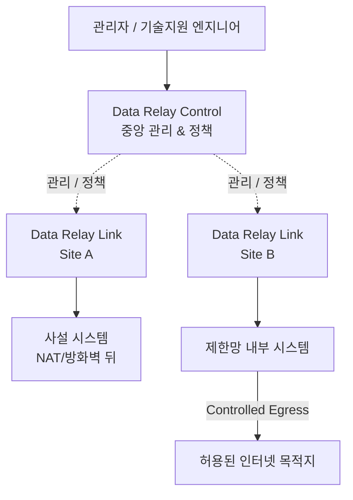
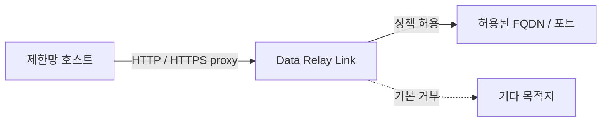

# Data Relay

**네트워크 전체를 연결하지 않고, 실제로 필요한 연결만 전달합니다.**

Data Relay는 폐쇄망, 제한망, 사설망 환경을 위한 경량 연결 플랫폼입니다. 역할이 분리된 두 제품으로 구성됩니다.

- **Data Relay Link** — Secure Remote Access와 Controlled Egress를 담당하는 연결 계층
- **Data Relay Control** — Data Relay 환경을 위한 중앙 관리 및 정책 계층

<Note>
  Data Relay의 목표는 연결 범위를 좁고 명확하게 유지하는 것입니다. 범용 VPN, 전체 RMM, 대규모 SASE 플랫폼을 대체하는 것을 목표로 하지 않습니다.
</Note>

## 30초 안에 이해하기

## 어떤 제품을 사용해야 하나요?

<CardGroup cols={2}>
  <Card title="Data Relay Link" icon="link" href="https://link.datarelay.run">
    NAT/방화벽 뒤 시스템의 Secure Remote Access와 제한망의 Controlled Egress를 제공합니다.
  </Card>

  <Card title="Data Relay Control" icon="sliders" href="https://control.datarelay.run">
    여러 Data Relay 환경의 중앙 관리, 정책, 가시성, 운영을 담당합니다.
  </Card>
</CardGroup>

## 두 가지 연결 방향

### Secure Remote Access

외부 → 내부

원격 시스템이 NAT 또는 방화벽 뒤에 있을 때, VPN 경로를 먼저 구성하지 않고 SSH, HTTP/HTTPS 또는 선택된 TCP 서비스를 제한적으로 공개할 수 있습니다.

### Controlled Egress

내부 → 허용된 인터넷 목적지

폐쇄망 또는 제한망 시스템이 인터넷 전체가 아니라 필요한 외부 서비스에만 접근해야 할 때 사용합니다.

## 제품 역할

| 영역 | Data Relay Link | Data Relay Control |
| --- | --- | --- |
| Secure Remote Access | **예** | 지원되는 범위에서 중앙 관리/정책 |
| Controlled Egress | **예** | 지원되는 범위에서 중앙 관리/정책 |
| 실제 연결 및 로컬 enforcement | **예** | 직접적인 데이터 경로가 주 역할은 아님 |
| 중앙 가시성 | 로컬 범위 | **주요 역할** |
| 중앙 정책 관리 | 로컬 정책 | **주요 역할** |
| 소규모 독립 배포 | **예** | 선택 사항 |

<Warning>
  Data Relay Control의 구현 범위와 릴리스 상태는 Control 전용 문서에서 확인해야 합니다. 이 통합 포털은 아직 확인되지 않은 기능을 지원한다고 가정하지 않습니다.
</Warning>

## 시작하기

<CardGroup cols={2}>
  <Card title="제품 선택" icon="route" href="/ko/getting-started/choose-a-product">
    Link만 필요한지, Control까지 필요한지 판단합니다.
  </Card>

  <Card title="플랫폼 아키텍처" icon="sitemap" href="/ko/platform/architecture">
    연결, 관리, 정책, 데이터 경로가 어떻게 분리되는지 확인합니다.
  </Card>

  <Card title="Link vs Control" icon="scale-balanced" href="/ko/platform/link-vs-control">
    두 제품의 역할과 배포 모델을 비교합니다.
  </Card>

  <Card title="제품 상태" icon="circle-info" href="/ko/reference/product-status">
    각 제품의 상세 릴리스 문서를 어디서 확인해야 하는지 안내합니다.
  </Card>
</CardGroup>
