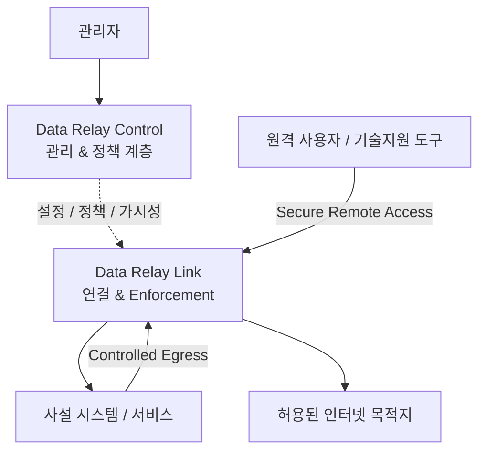
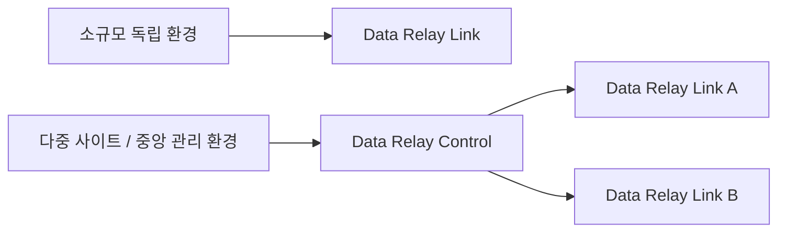

# 플랫폼 아키텍처

Data Relay는 **연결/데이터 경로**와 **관리 및 정책 계층**을 분리합니다.

## 연결 계층

**Data Relay Link**가 실제 연결을 담당합니다. 사용 목적에 따라 선택된 inbound 서비스 연결이나 선택된 outbound HTTP/HTTPS 연결을 relay합니다.

핵심 보안 개념은 **의도적으로 허용된 연결만 존재하게 하는 것**입니다.

## 관리 및 정책 계층

**Data Relay Control**은 여러 Data Relay 배포를 중앙에서 관리해야 할 때 사용하는 운영 계층입니다. Control API, identity, 동기화 방식, 정책 객체의 정확한 구현 범위는 Control 제품 문서가 기준입니다.

## 독립 운영과 중앙 관리

작은 환경에서는 Data Relay Link만 직접 운영할 수 있습니다. 중앙 가시성, 공통 정책, 통합 운영이 실제 요구사항이 될 때 Data Relay Control을 추가합니다.

## 주요 Trust Boundary

운영자는 최소 다음 네 경계를 구분해서 봐야 합니다.

1. **관리자 → Control** — 관리 인증과 권한
2. **Control → Link** — 제품 간 관리 신뢰
3. **외부 사용자 → 공개 서비스** — Remote Access 노출과 대상 서비스 인증
4. **제한망 호스트 → Internet** — Controlled Egress 목적지 정책과 거부 동작

각 구현 세부사항은 해당 제품의 보안 문서가 기준입니다.
