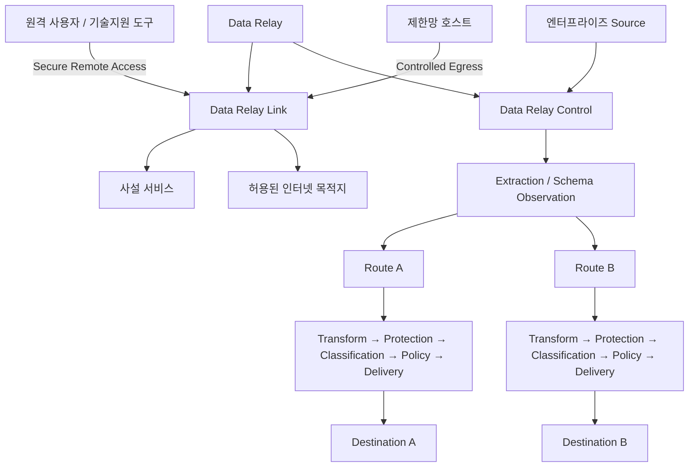
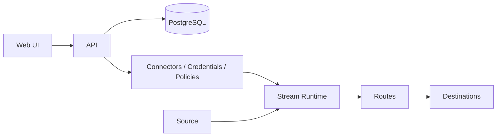
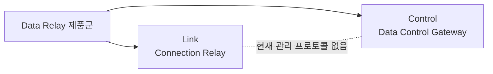

# 플랫폼 아키텍처

현재 Data Relay 제품군에는 서로 다른 두 runtime 경로가 존재합니다.

## Data Relay Link 경로

Data Relay Link는 **Connection**을 relay합니다.

설정한 사용 목적에 따라 다음을 제공합니다.

- 외부 → 내부의 선택된 사설 서비스 접근
- 내부 → 허용된 인터넷 목적지의 HTTP/HTTPS 접근
- 해당 연결에 대한 로컬 서비스/정책 enforcement

핵심은 네트워크 전체가 아니라 **명시적으로 허용된 연결만 존재하게 하는 것**입니다.

## Data Relay Control 경로

Data Relay Control은 **엔터프라이즈 Event/Record**를 처리합니다.

현재 구현은 관리/control plane과 실제 data-delivery runtime을 함께 포함합니다.

Stream은 실행과 checkpoint 상태를 소유하고, 각 Route는 목적지별 처리와 delivery를 담당합니다.

## 현재는 Control Plane / Data Plane 쌍이 아님

기존 통합 페이지는 Data Relay Control이 Data Relay Link를 중앙에서 관리하는 구조처럼 설명했지만, **현재 Control 구현은 이를 지원하지 않습니다.**

현재 구현되어 있지 않은 제품 간 기능:

- Link 등록
- Link heartbeat / 상태 동기화
- 중앙 Link 정책 배포
- Link 상태 synchronization

따라서 현재의 정확한 구조는 다음과 같습니다.

## 주요 Trust Boundary

두 제품은 서로 다른 trust boundary를 갖습니다.

**Data Relay Link**

1. 관리자 → Link 관리 surface
2. 외부 사용자 → 공개된 사설 서비스
3. 제한망 호스트 → 허용된 인터넷 목적지

**Data Relay Control**

1. Browser/관리자 → Control API/UI
2. Control runtime → PostgreSQL
3. Control runtime → Source 시스템
4. Control runtime → Destination 시스템
5. Stream/Route runtime 내부의 Credential 및 Governance 처리

세부 구현은 각 제품의 보안 문서를 기준으로 합니다.
