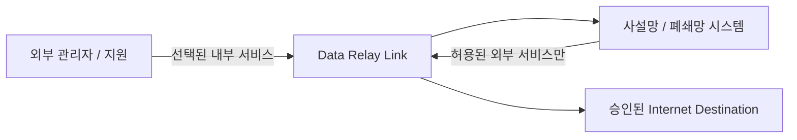
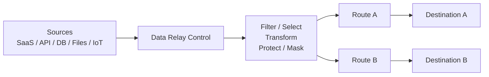

# 제품 아키텍처

Data Relay Link와 Data Relay Control은 **Relay하는 대상 자체가 다르기 때문에 아키텍처도 서로 다릅니다.**

## Data Relay Link 아키텍처

Link는 서로 연결하기 어려운 Network Zone 사이의 **Connection**을 Relay합니다.



주요 활용 방향은 두 가지입니다.

1. **외부 → 내부:** 명시적으로 선택된 내부 서비스에 대한 안전한 접속
2. **내부 → 외부:** 허용된 외부 목적지에만 제한적으로 연결

제품 자료는 접근 제어, 외부 연결 제어, 접속 기록/감사, 그리고 VPN/NAT/방화벽/Proxy를 요구사항마다 따로 관리하는 부담 감소를 강조합니다.

## Data Relay Control 아키텍처

Control은 Enterprise Source의 **Application Data와 Event**를 하나 이상의 Destination으로 Broker합니다.



하나의 Source를 한 번 수집한 뒤 여러 Destination으로 전달할 수 있고, Destination별로 필요한 데이터만 선택하거나 서로 다른 Transformation/Protection을 적용할 수 있습니다.

제품 자료에 나타난 Stream 생성 흐름은 다음과 같습니다.

```text
Connect → Sample & Record Selection → Destinations → Route Processing → Deploy
```

## 하나의 통합 아키텍처가 아닙니다

<Warning>
  Link와 Control을 하나의 Control Plane/Data Plane 쌍으로 해석하면 안 됩니다. Link는 Connectivity Relay이고, Control은 Enterprise Data Broker입니다. 두 제품은 데이터 경로와 운영 목적이 서로 다릅니다.
</Warning>

세부 구현은 [Data Relay Link](https://link.datarelay.run)와 [Data Relay Control](https://control.datarelay.run) 전용 문서를 각각 확인합니다.
