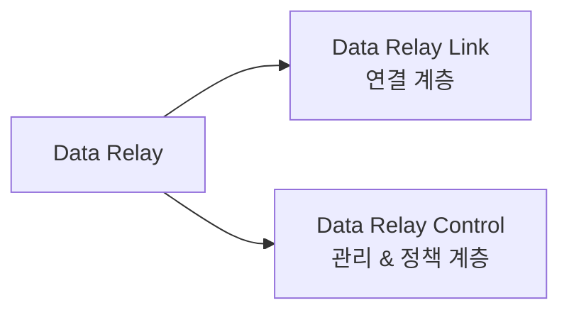

# 플랫폼 개요

Data Relay의 핵심 원칙은 하나입니다.

> **네트워크 전체를 연결하지 않고, 실제로 필요한 연결만 전달합니다.**

이 원칙은 양방향에 모두 적용됩니다.

- **Remote Access:** 외부에서 선택된 내부 서비스에만 접근
- **Controlled Egress:** 내부 시스템이 허용된 외부 목적지에만 접근

## 제품 구성

### Data Relay Link

Data Relay Link는 실제 연결을 담당하는 제품입니다. 소규모 환경에서는 Data Relay Control 없이 독립적으로 사용할 수 있습니다.

주요 역할:

- Secure Remote Access
- Controlled Egress
- 로컬 서비스 및 정책 enforcement
- 배포와 운영 도구

[Data Relay Link 문서 열기](https://link.datarelay.run)

### Data Relay Control

Data Relay Control은 여러 Data Relay 환경을 한 곳에서 운영해야 할 때 사용하는 중앙 관리 및 정책 계층입니다.

현재 구현 범위, 설치 방식, 릴리스 상태는 별도 Control 문서에서 관리합니다.

[Data Relay Control 문서 열기](https://control.datarelay.run)

## Data Relay가 목표로 하지 않는 것

Data Relay는 광범위한 네트워크 대체 제품을 지향하지 않습니다. 다음 기능을 자동으로 제공한다고 보면 안 됩니다.

- 전체 Layer-3 VPN
- 무제한 site-to-site routing
- 범용 Enterprise RMM
- 완전한 Secure Web Gateway
- TLS inspection / content inspection
- DLP, CASB, malware sandboxing, browser isolation
- 대규모 SASE control plane

향후 기능이 추가되더라도 실제 구현된 기능과 roadmap 항목은 항상 구분되어야 합니다.
