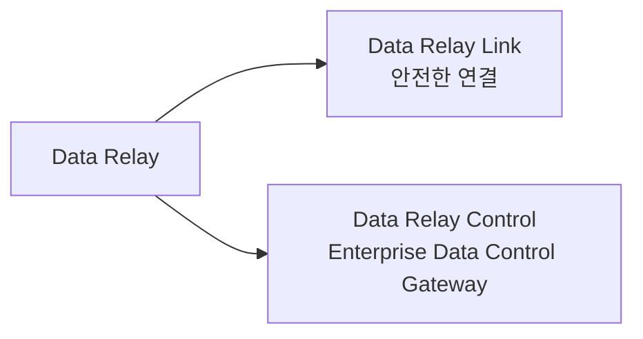

# 플랫폼 개요

Data Relay는 **필요한 것만 전달한다**는 공통 방향 아래 두 가지 서로 다른 문제를 해결합니다.

- **Data Relay Link** — 필요한 **연결(Connection)**만 전달
- **Data Relay Control** — 필요한 **엔터프라이즈 데이터(Event/Record)**를 수집·처리·전달

두 제품은 같은 제품군이지만 현재 하나의 tightly-coupled runtime으로 동작하지는 않습니다.

## 제품 구성



### Data Relay Link

Data Relay Link는 사설망과 제한망의 연결 문제를 해결하는 제품입니다.

주요 역할:

- 선택된 내부 서비스에 대한 Secure Remote Access
- 허용된 인터넷 목적지에 대한 Controlled Egress
- 로컬 연결 및 접근 정책 enforcement
- 배포, 진단, lifecycle, backup/restore 도구
- 소규모 환경에서의 독립 운영

주요 처리 단위는 **Connection**입니다.

[Data Relay Link 문서 열기](https://link.datarelay.run)

### Data Relay Control

Data Relay Control은 **Enterprise Data Control Gateway**입니다. 실제 데이터 경로에서 데이터를 수집하거나 수신하고, 처리·보호·정책 적용한 뒤 하나 이상의 목적지로 전달합니다.

핵심 runtime 모델은 다음과 같습니다.

```text
One Stream → Many Routes → Many Destinations
```

현재 문서로 확인되는 주요 기능은 다음과 같습니다.

- Connector, Credential, Source, Stream, Route, Destination 관리
- Mapping/Enrichment 기반 Transform
- 선택적 Protection, Classification, Policy, Quarantine, Replay
- 목적지별 Route Processing
- runtime evidence, audit, health, backup/restore, maintenance
- local JWT authentication 및 RBAC
- 감사된 개발 브랜치의 Marketplace와 Safe Change 계열 기능

주요 처리 단위는 **Stream과 Route를 통해 흐르는 Event/Record**입니다.

[Data Relay Control 문서 열기](https://control.datarelay.run)

## 현재 Link와 Control의 관계

<Warning>
  Data Relay Control은 **현재 Data Relay Link의 중앙관리 서버가 아닙니다.** 현재 Control 소스에는 Link 등록, heartbeat, Link 정책 배포, Link 상태 동기화가 구현되어 있지 않습니다.
</Warning>

현재 배포에서는 Link와 Control을 같은 제품군의 **서로 다른 독립 제품**으로 보는 것이 정확합니다.

## Data Relay 제품군이 자동으로 의미하지 않는 것

Data Relay라는 이름만으로 다음 기능을 지원한다고 판단하면 안 됩니다.

- 전체 Layer-3 VPN 또는 무제한 site-to-site routing
- 범용 Enterprise RMM
- SASE/SWG 대체 제품
- SIEM, SOAR, Data Lake
- 아직 구현되지 않은 Link 중앙관리 프로토콜
- 각 제품 문서에서 명시하지 않은 HA / multi-node 기능

실제 구현 및 릴리스 상태는 항상 각 제품 전용 문서를 기준으로 합니다.
