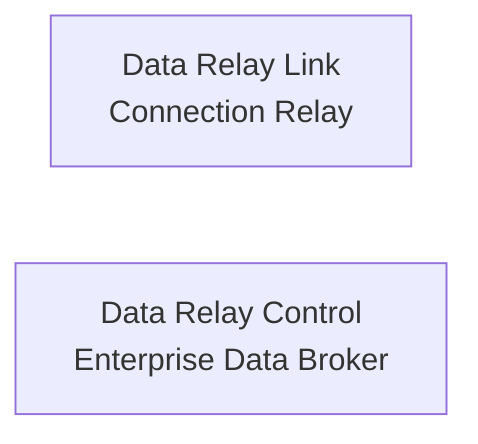

# 제품 개요

Data Relay는 비슷한 설계 철학을 공유하지만 역할은 전혀 다른 **두 독립 제품**의 공통 이름입니다.

두 제품 사이에 필수 의존 관계는 없습니다.

## Data Relay Link

Data Relay Link는 **사설망·폐쇄망·제한망의 안전한 양방향 연결**을 위한 제품입니다.

두 방향을 다룹니다.

- **외부 → 내부:** 관리자/지원 엔지니어가 SSH, Web, RDP, API 등 선택된 내부 서비스에만 접속
- **내부 → 외부:** 내부 시스템이 보안 업데이트, 패키지 저장소, 라이선스 서버, 허용된 SaaS/API 등 승인된 외부 목적지에만 접속

전체 네트워크를 여는 대신 실제로 필요한 연결만 허용하는 것이 핵심입니다. 접근 제어, 허용 목적지 관리, 접속 기록/감사, VPN/NAT/방화벽/Proxy/Squid 설정 부담 감소를 지향합니다.

[Data Relay Link 문서 열기](https://link.datarelay.run)

## Data Relay Control

Data Relay Control은 **Application Data/Event를 위한 Enterprise Data Broker**입니다.

SaaS Application, API, Database, File/Log, Device/IoT 등에서 데이터를 수집하고 필요한 처리를 거쳐 SIEM, XDR, Data Lake, SOAR, Analytics, Custom Application 등으로 전달합니다.

핵심 개념은 다음과 같습니다.

- 한 번 수집하고 여러 Destination으로 전달
- 필요한 Record/Field만 선택
- 전달 전 Transformation
- 민감하거나 불필요한 데이터 Masking/Removal
- Destination별 처리
- 데이터 전달 상태를 중앙에서 가시화하고 관리

[Data Relay Control 문서 열기](https://control.datarelay.run)

## 같은 생각, 다른 Layer

| | Data Relay Link | Data Relay Control |
| --- | --- | --- |
| 다루는 대상 | Network Connection | Application Data/Event |
| 핵심 문제 | Reachability / Access Control | Data Integration / Delivery |
| 대표 흐름 | 외부 ↔ 사설/제한망 | Source → Broker → Destination |
| 핵심 원칙 | 필요한 연결만 허용 | 필요한 데이터만 필요한 형태로 전달 |

설치, 운영, 지원 범위와 구현 세부사항은 각 제품 전용 문서를 기준으로 확인합니다.
