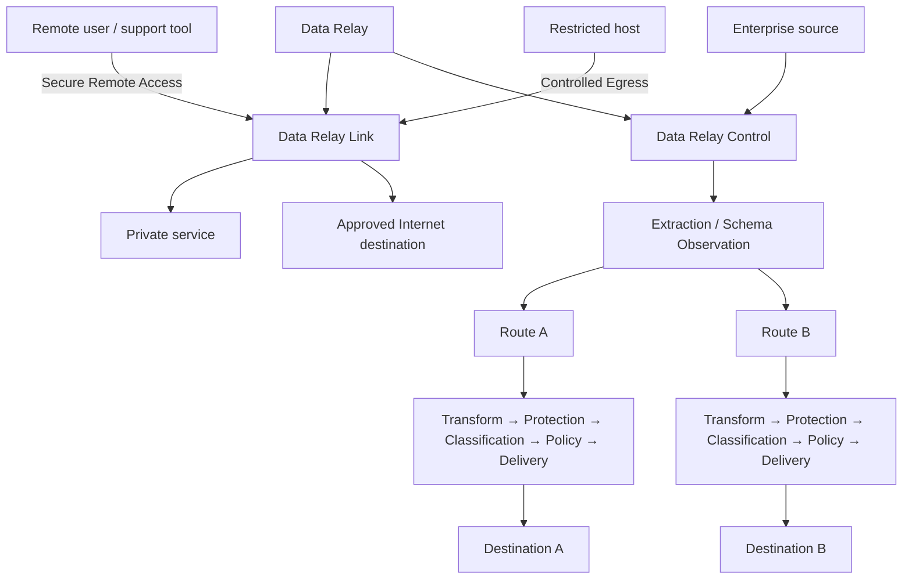
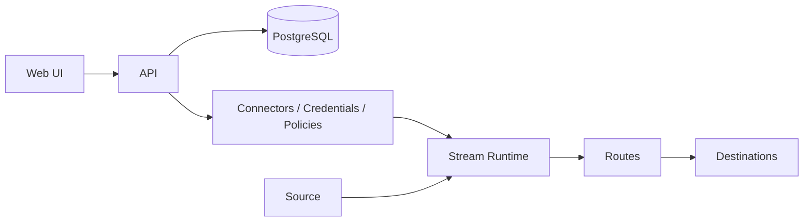
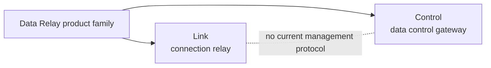

# Platform Architecture

Data Relay currently contains two independent runtime paths under one product family.

## Data Relay Link path

Data Relay Link relays **connections**.

Depending on the configured use case, it provides:

- outside → inside access to selected private services;
- inside → approved Internet HTTP/HTTPS access;
- local policy and service enforcement around those connections.

Link is intentionally narrow: a connection exists because an operator explicitly published or allowed it.

## Data Relay Control path

Data Relay Control processes **enterprise events and records**.

The current implementation combines a management/control plane with an active data-delivery runtime:

A Stream owns execution and checkpoint state. Each Route owns destination-specific processing and delivery.

## They are not a control-plane/data-plane pair today

Earlier platform descriptions implied that Data Relay Control centrally managed Data Relay Link. That is **not supported by the current Control implementation**.

There is currently no implemented product-to-product protocol for:

- Link registration;
- Link heartbeat/status synchronization;
- centralized Link policy delivery;
- Link state synchronization.

Therefore the correct current model is:

## Trust boundaries

The two products have different trust boundaries.

**Data Relay Link** focuses on:

1. operator/admin → Link management surface;
2. external user → published private service;
3. restricted host → approved Internet destination.

**Data Relay Control** focuses on:

1. browser/operator → Control API/UI;
2. Control runtime → PostgreSQL;
3. Control runtime → source systems;
4. Control runtime → destination systems;
5. credentials and governance stages inside the Stream/Route runtime.

Use each product's security documentation for implementation details.
