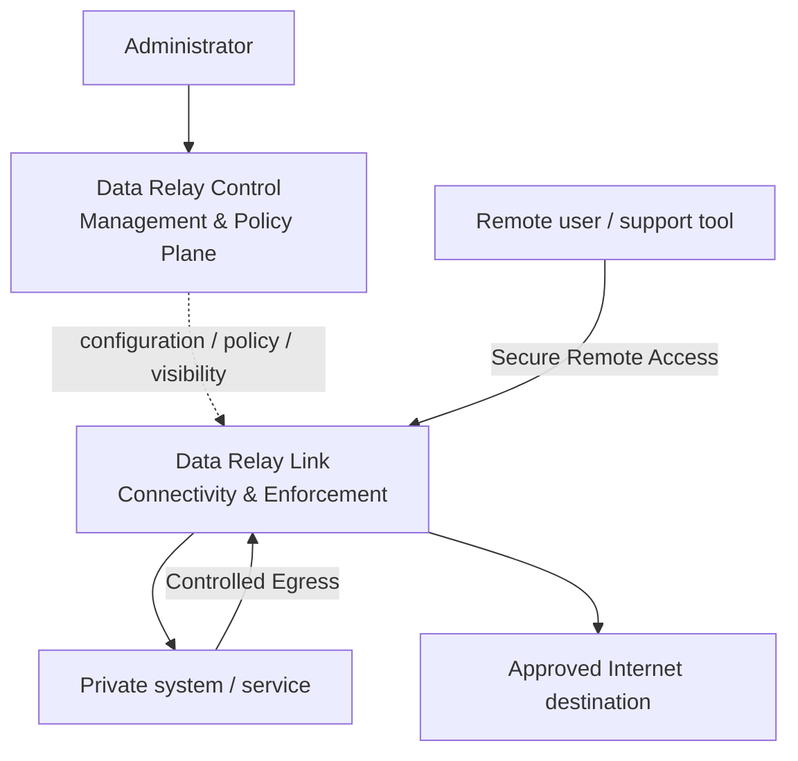
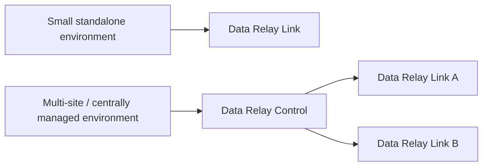

# Platform Architecture

Data Relay separates the **connectivity/data path** from the **management and policy plane**.

## Connectivity layer

**Data Relay Link** owns the connectivity function. Depending on the configured use case, it relays selected inbound service connections or selected outbound HTTP/HTTPS connections.

The core security idea is narrow reachability: a connection should exist only because an operator intentionally published or allowed it.

## Management and policy layer

**Data Relay Control** provides the centralized operational layer for deployments that need a shared management surface. The exact control APIs, identity model, synchronization behavior, and supported policy objects are documented in the Control product documentation because they evolve independently from Link.

## Standalone vs centrally managed

A small environment can use Data Relay Link directly. Data Relay Control becomes relevant when centralized visibility, shared policy, or coordinated operations are required.

## Trust boundaries

Operators should think about at least four boundaries:

1. **Administrator → Control** — management authentication and authorization.
2. **Control → Link** — product-to-product management trust.
3. **External user → published service** — Remote Access exposure and service authentication.
4. **Restricted host → Internet** — Controlled Egress destination policy and deny behavior.

Each product's security documentation is authoritative for its own implementation details.
