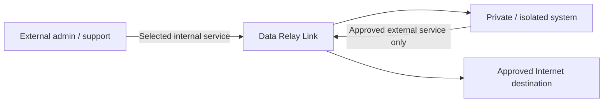
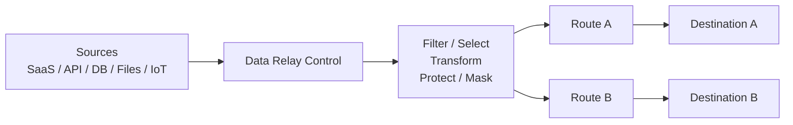

# Product Architectures

Data Relay Link and Data Relay Control have **different architectures because they relay different things**.

## Data Relay Link architecture

Link relays **connections** between otherwise difficult-to-connect network zones.



The two primary use cases are:

1. **External → Internal:** secure access to explicitly selected internal services.
2. **Internal → External:** restricted Internet connectivity only to approved destinations.

The product material emphasizes centralized access control, outbound connection control, connection records/audit, and easier operation than managing separate VPN/NAT/firewall/proxy paths for every requirement.

## Data Relay Control architecture

Control brokers **application-layer data and events** from enterprise sources to one or more destinations.



A source can be collected once and then delivered to multiple destinations. Each destination can receive only the required data and, where needed, a destination-specific transformed or protected version.

The product material shows a Stream onboarding workflow of:

```text
Connect → Sample & Record Selection → Destinations → Route Processing → Deploy
```

## They are not one combined architecture

<Warning>
  Do not model Link and Control as a control-plane/data-plane pair. Link is a connectivity relay; Control is an enterprise data broker. Their data paths and operational purposes are separate.
</Warning>

[Data Relay Link](https://link.datarelay.run) and [Data Relay Control](https://control.datarelay.run) each have their own detailed documentation.
