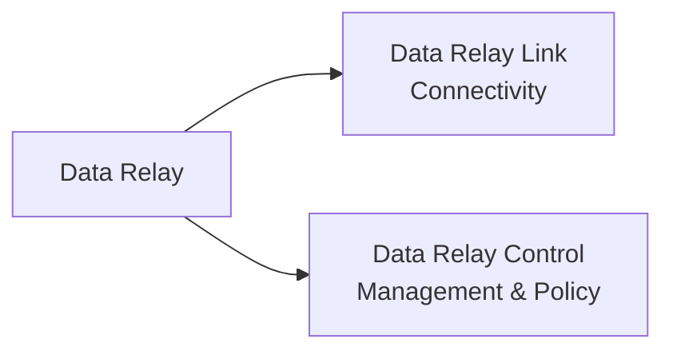

# Platform Overview

Data Relay is built around one principle:

> **Do not connect entire networks. Relay only the connections that are actually needed.**

That principle applies in both directions:

- **Remote Access:** allow selected outside users or tools to reach selected internal services.
- **Controlled Egress:** allow selected internal systems to reach selected Internet destinations.

## Product family

### Data Relay Link

Data Relay Link is the connectivity component. It is designed for small, focused deployments and can operate without a centralized Control deployment.

Primary roles:

- Secure Remote Access
- Controlled Egress
- local service and policy enforcement
- deployment and operational tooling

[Open Data Relay Link documentation](https://link.datarelay.run)

### Data Relay Control

Data Relay Control is the centralized management and policy component for environments that need to manage Data Relay deployments from one place.

Its current implemented scope, installation model, and release status are maintained in the dedicated product documentation.

[Open Data Relay Control documentation](https://control.datarelay.run)

## What Data Relay is not

Data Relay intentionally avoids broad network replacement scope. It should not be interpreted as automatically providing:

- a full Layer-3 VPN
- unrestricted site-to-site routing
- a general-purpose enterprise RMM
- a full Secure Web Gateway
- TLS inspection or content inspection
- DLP, CASB, malware sandboxing, or browser isolation
- a large-scale SASE control plane

Individual products may add capabilities over time, but the platform documentation should always distinguish implemented features from roadmap ideas.
