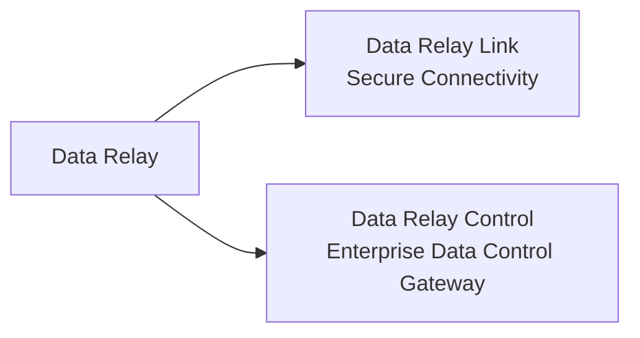

# Platform Overview

Data Relay is a product family for moving only what is required, with two different scopes:

- move a **connection** with **Data Relay Link**;
- move and govern **enterprise data** with **Data Relay Control**.

The two products share a product family and a focus on explicit, controlled data movement, but they are not currently one tightly coupled runtime.

## Product family



### Data Relay Link

Data Relay Link is the connectivity product for private and restricted networks.

Primary roles:

- Secure Remote Access to selected internal services
- Controlled Egress to approved Internet destinations
- local connectivity and access-policy enforcement
- deployment, diagnostics, lifecycle, and backup/restore tooling
- focused standalone operation for small environments

Its primary unit is a **connection**.

[Open Data Relay Link documentation](https://link.datarelay.run)

### Data Relay Control

Data Relay Control is an **Enterprise Data Control Gateway**. It actively participates in the data path by collecting or receiving records, processing them, applying optional governance/protection, and delivering them to one or more destinations.

Its core runtime model is:

```text
One Stream → Many Routes → Many Destinations
```

Current documented capabilities include:

- Connector, Credential, Source, Stream, Route, and Destination management
- Transform through Mapping/Enrichment
- optional Protection, Classification, Policy, Quarantine, and Replay
- destination-specific route processing
- runtime evidence, audit, health, backup/restore, and maintenance
- local JWT authentication and RBAC
- Marketplace and safe-change capabilities on the audited development branch

Its primary unit is an **event or record flowing through a Stream and Route**.

[Open Data Relay Control documentation](https://control.datarelay.run)

## Current relationship between Link and Control

<Warning>
  Data Relay Control is **not currently the centralized management server for Data Relay Link**. The current Control source does not implement Link registration, heartbeat, Link policy delivery, or Link state synchronization.
</Warning>

For current deployments, treat Link and Control as separate products that solve different problems under the same Data Relay family.

## What the product family is not

The Data Relay name should not be interpreted as automatically providing:

- a full Layer-3 VPN or unrestricted site-to-site routing;
- a generic enterprise RMM platform;
- a SASE/SWG replacement;
- a SIEM, SOAR, or data lake;
- a centralized Link management protocol that is not yet implemented;
- high-availability or multi-node behavior unless the individual product documentation explicitly supports it.

Always use the dedicated product documentation as the source of truth for implementation and release status.
