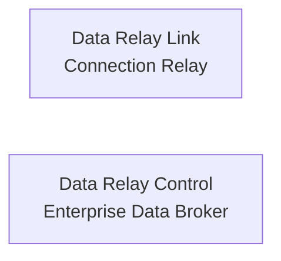

# Product Overview

Data Relay is the shared name for **two independent products** with a similar design philosophy but different jobs.

There is no dependency implied between them.

## Data Relay Link

Data Relay Link is for **secure bidirectional connectivity in private, isolated, and restricted networks**.

It addresses two directions:

- **Outside → inside:** let an administrator or support engineer reach selected internal services such as SSH, web, RDP, or API services.
- **Inside → outside:** let internal systems reach only approved external services such as security updates, package repositories, license servers, and approved SaaS/API endpoints.

The design goal is to avoid opening entire networks when only a few connections are required. It emphasizes access control, approved-destination control, connection logging/audit, and simpler operation than repeatedly changing VPN, NAT, firewall, proxy, or Squid configurations.

[Open Data Relay Link documentation](https://link.datarelay.run)

## Data Relay Control

Data Relay Control is an **Enterprise Data Broker for application data and events**.

It collects from sources such as SaaS applications, APIs, databases, files/logs, and devices/IoT, processes the data, and distributes it to destinations such as SIEM, XDR, Data Lake, SOAR, analytics platforms, and custom applications.

Its core ideas are:

- collect once and send to many destinations;
- select only the needed records or fields;
- transform data before delivery;
- mask/remove sensitive or unnecessary data;
- apply destination-specific processing;
- monitor and manage delivery centrally.

[Open Data Relay Control documentation](https://control.datarelay.run)

## Shared idea, different layer

| | Data Relay Link | Data Relay Control |
| --- | --- | --- |
| Works with | Network connections | Application data/events |
| Main problem | Reachability and access control | Data integration and delivery |
| Typical flow | Outside ↔ restricted/private network | Sources → broker → destinations |
| Core principle | Allow only required connections | Deliver only required data in the required form |

Use the dedicated product documentation for installation, operation, and implementation details.
